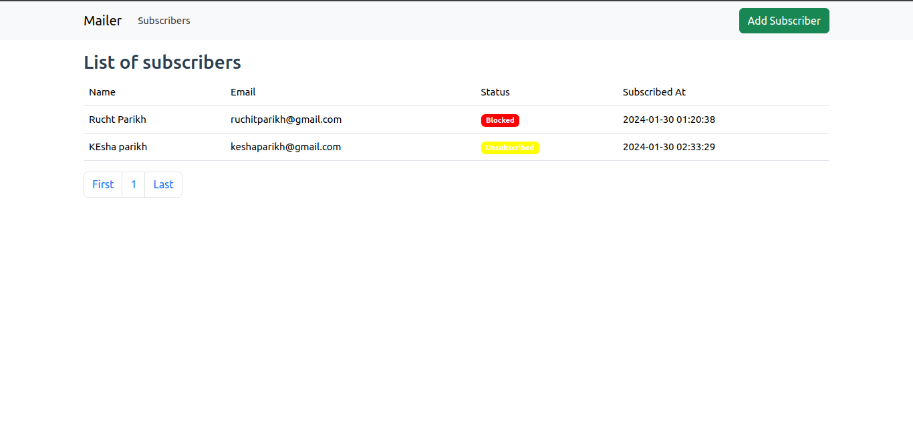
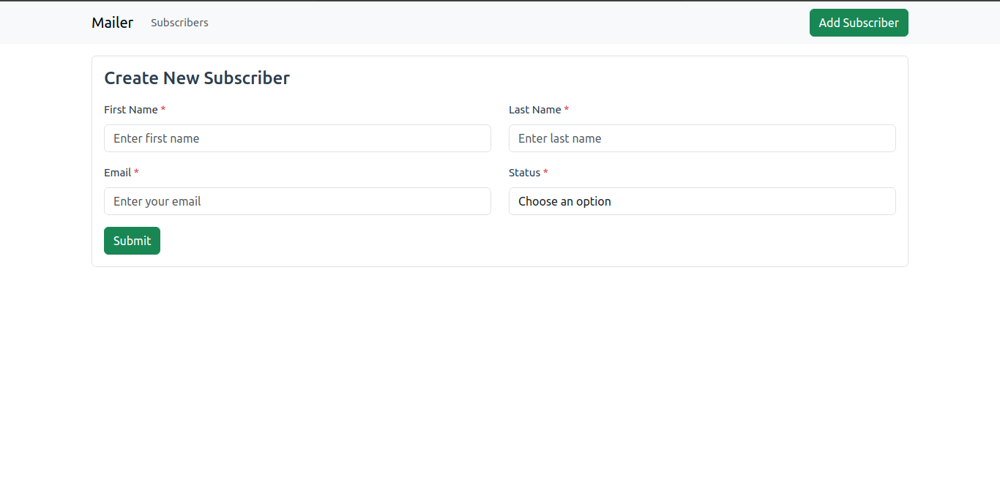
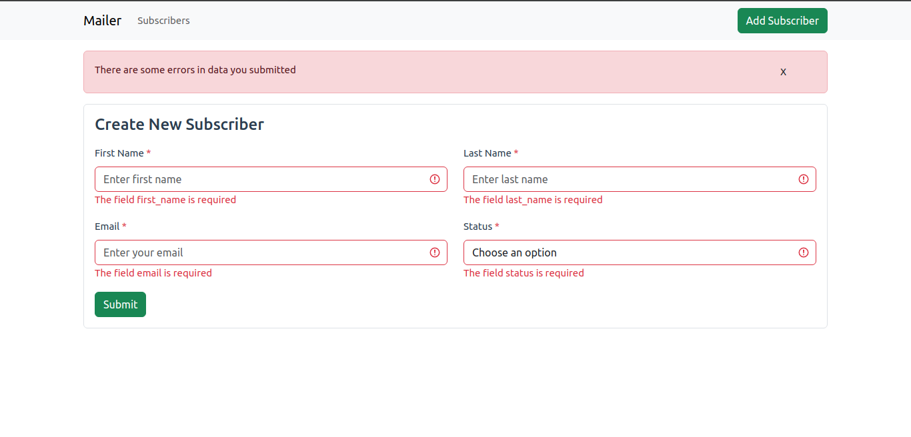
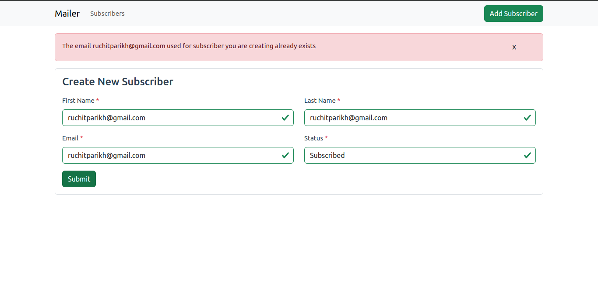
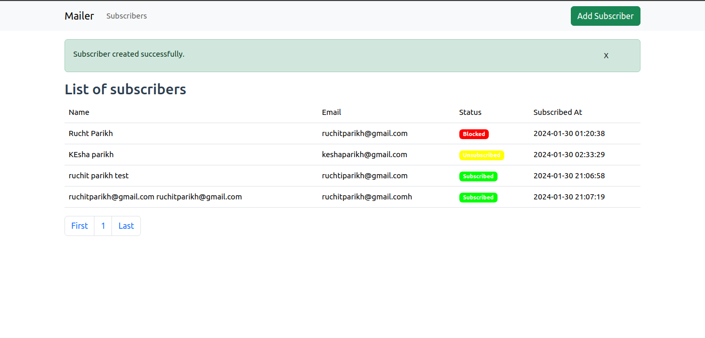

### How to setup client (Vue App) 

#### Requirements

- You will need NPM for cli so Nodejs installed

#### How to install
- Install dependencies using npm 

```javascript
npm install
```

- As we are going to consume PHP server api we need to set endpoint url to **API_URL** in **configuration.js** provided **on frontend directory**
- Once you set configurations. You can run front end app using npm in dev mode and you can access it on browser with npm server provided url

```javascript
npm run dev
```

- Thats it. You are good to go

Below is how it will appear






